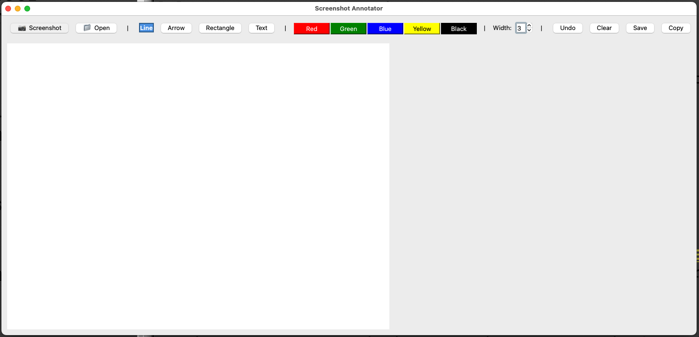

# Screenshot Annotator

A fast screenshot annotation tool for macOS. Capture screenshots (full or partial) and quickly annotate them with lines, arrows, rectangles, and text.



## Features

- Capture partial screen areas (click and drag to select)
- Draw lines, arrows, and rectangles
- Add text annotations
- Multiple colors (red, green, blue, yellow, black)
- Adjustable line width
- Undo functionality
- Save to file or copy to clipboard

## Installation

### From PyPI (recommended)

```bash
pip install dbbasic-screenshot
```

### From source

```bash
git clone https://github.com/askrobots/dbbasic-screenshot.git
cd dbbasic-screenshot
pip install -e .
```

## Usage

After installation, just run:

```bash
dbbasic-screenshot
```

### Workflow

1. When launched, choose to capture a new screenshot or open an existing image
2. For new screenshots: Click and drag to select the area you want to capture
3. Use the toolbar to select tools and colors
4. Draw annotations on your screenshot
5. Save or copy to clipboard

### Tools

- **Line**: Draw straight lines
- **Arrow**: Draw arrows to point at things
- **Rectangle**: Draw boxes around areas
- **Text**: Click to add text labels

## Tips

- The partial screen capture is fast and easy - click and drag to select only the area you need
- Use different colors to highlight different types of information
- Adjust line width for thicker or thinner annotations
- Text annotations use a clear, bold font

## Requirements

- macOS (uses native screencapture command)
- Python 3.7+
- PyQt5
- Pillow
